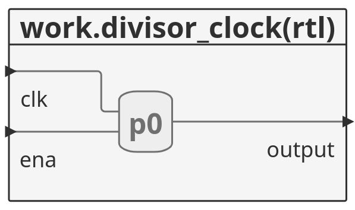

# Tutorial do Github

Esse é um básico tutorial do gihub.

## Parte 1

Mais um texo...




- Teste
- Teste 2
- Teste 3


1. Item 1
2. Item 2
3. __Item 3__


```C
int main(){

  puts("Olá mundo");

}
```

# Referências

- [Tutorial Markdown](https://docs.pipz.com/central-de-ajuda/learning-center/guia-basico-de-markdown#open)
